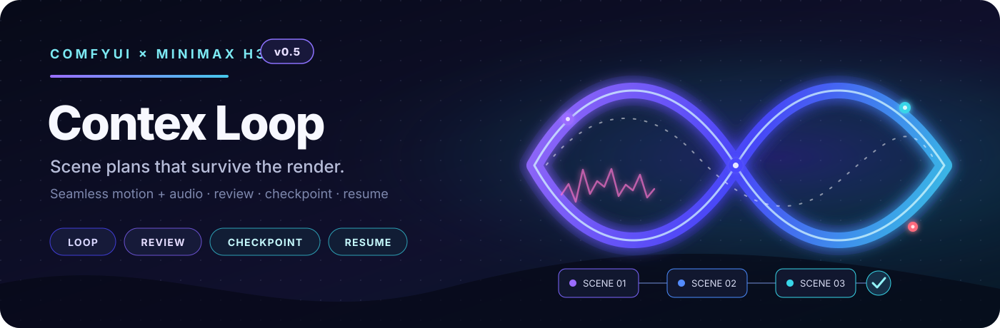

<p align="center">
  
</p>

# ComfyUI MiniMax H3 Contex Loop

Build a multi-scene MiniMax H3 video with one reusable sampling body. Review
each scene, retry mistakes, resume interrupted runs, and assemble accepted
scenes from disk.

**[Getting started](https://github.com/ethanfel/ComfyUI-MiniMaxH3-Contex-Loop/wiki/Getting-Started)** ·
**[Choose a workflow](https://github.com/ethanfel/ComfyUI-MiniMaxH3-Contex-Loop/wiki/Workflow-Chooser)** ·
**[Troubleshooting](https://github.com/ethanfel/ComfyUI-MiniMaxH3-Contex-Loop/wiki/Troubleshooting)** ·
[Full wiki](https://github.com/ethanfel/ComfyUI-MiniMaxH3-Contex-Loop/wiki)

> **Version 0.5 status:** `main` is the supported 0.5 release line.
> Saved 0.4 workflows and checkpoints remain supported.

> **Contex** is the intentional public repository spelling.

## What you get

| Goal | This pack provides |
|---|---|
| Make a longer story | A visual scene Plan drives one recursive H3 graph. |
| Keep motion and sound connected | Guide and protected AV-prefix transitions. |
| Direct each scene | Prompts, seeds, timing, pictures, motion video, and audio references. |
| Work from existing footage | Source timelines, clip continuation, inpainting, and two-ended bridges. |
| Iterate safely | Review, edit and retry, reroll, stop early, and atomic checkpoints. |
| Recover the production | Resume, partial assembly, saved assets, and latent-to-PNG export. |

## Quick start

From `ComfyUI/custom_nodes`:

```bash
git clone https://github.com/ethanfel/ComfyUI-MiniMaxH3-Contex-Loop.git
```

Restart ComfyUI, then:

1. Open a maintained workflow from [`example_workflows/`](example_workflows/).
2. Resolve missing model selections; models are not bundled.
3. Give Plan a unique `run_name` and edit its scene prompts.
   Use `{wide shot|close-up}` for random alternatives. Plan's independent
   `prompt_seed` defaults to Randomize after each queue; set it to Fixed when
   you need to reproduce the same choices without changing sampler seeds.
4. Keep **Guide** and **Generated audio** for a simple first run.
5. Queue the graph. Preflight checks timing, media, references, compatibility,
   and resume state before H3 loads.
6. At Review Gate, approve, retry, reroll, or approve and stop. To compare
   several takes per scene, set its optional `candidate_count` above 1 (or
   convert it to an input and connect an INT node); Review Gate generates the
   candidates automatically and continues from the exact take you select.
7. Assemble the completed or partial manifest.

Version 0.5 expects a current ComfyUI build containing native **Add Guide for
MiniMax H3** from [ComfyUI PR #15439](https://github.com/Comfy-Org/ComfyUI/pull/15439).
`ffmpeg` on `PATH` is preferred; ComfyUI's bundled PyAV can handle review and
assembly when FFmpeg is unavailable.

Some examples need bundled media copied into `ComfyUI/input/`. See the
[asset guide](example_workflows/assets/README.md).

## Choose a workflow

| I want to… | Start here |
|---|---|
| Generate from text | [T2V Normal](<example_workflows/MiniMax H3 T2V - Normal.json>) |
| Animate an opening image | [I2V Normal](<example_workflows/MiniMax H3 I2V - Normal.json>) |
| Move between first/last images | [FL2V Normal](<example_workflows/MiniMax H3 FL2V - Normal.json>) |
| Use prompt-driven pictures | [Ref2V Tagged](<example_workflows/MiniMax H3 Ref2V - Tagged.json>) |
| Guide scenes with a source soundtrack | [Ref2V Studio Tagged Source Audio](<example_workflows/MiniMax H3 Ref2V - Studio Tagged Source Audio.json>) |
| Inpaint a fixed or tracked region | [Masked Video Inpaint](<example_workflows/MiniMax H3 - Masked Video Inpaint.json>) |
| Inpaint with a picture-defined replacement | [Ref2V Masked Video Inpaint](<example_workflows/MiniMax H3 Ref2V - Masked Video Inpaint.json>) |
| Continue one existing clip | [Masked AV Extension — Single Clip](<example_workflows/MiniMax H3 - Masked AV Extension - Single Clip.json>) |
| Continue several reviewed scenes | [Masked AV Extension — Chain](<example_workflows/MiniMax H3 - Masked AV Extension - Chain + Reference Image.json>) |
| Generate the gap between two clips | [Two-Clip Masked AV Bridge](<example_workflows/MiniMax H3 - Masked AV Bridge - Two Clips.json>) |

Choose **Normal** for the standard Plan and Scene Prompt Editor. **Studio**
workflows add an optional experimental timeline interface without changing the
generation graph. The [wiki workflow chooser](https://github.com/ethanfel/ComfyUI-MiniMaxH3-Contex-Loop/wiki/Workflow-Chooser)
explains every maintained example and required asset.

## How it works

```text
Chain Policy → [Advanced] → [Legacy 0.4] → Plan
Source Timeline ───────────────────────────┘
                                             ↓
                           Preflight → Loop Start → Current Shot
                                                        ↓
                                      H3 conditioning → sample → decode
                                                        ↓
                                      trim → checkpoint → review → Loop End ─↺

Loop End manifest → Assemble
```

Only one scene passes through the sampling body at a time. The accepted
predecessor supplies continuity to the next scene; completed media and recovery
metadata remain on disk.

## Find help by task

| Task | Guide |
|---|---|
| Install and run the first scene | [Getting started](https://github.com/ethanfel/ComfyUI-MiniMaxH3-Contex-Loop/wiki/Getting-Started) |
| Choose Cut, Guide, Hard AV, Soft AV, or audio behavior | [Continuity and audio](https://github.com/ethanfel/ComfyUI-MiniMaxH3-Contex-Loop/wiki/Continuity-and-Audio) |
| Use `@tags`, motion references, or Source Timeline | [References and source media](https://github.com/ethanfel/ComfyUI-MiniMaxH3-Contex-Loop/wiki/References-and-Source-Media) |
| Inpaint, outpaint, extend, or bridge footage | [Masked editing](https://github.com/ethanfel/ComfyUI-MiniMaxH3-Contex-Loop/wiki/Masked-Editing) |
| Retry, resume, recover, or assemble later | [Review, resume, and recovery](https://github.com/ethanfel/ComfyUI-MiniMaxH3-Contex-Loop/wiki/Review-Resume-and-Recovery) |
| Upscale a completed checkpoint branch | [Runs, review, and recovery](docs/RUNS_AND_RECOVERY.md#whole-chain-seedvr2-finishing) |
| Diagnose a problem | [Troubleshooting](https://github.com/ethanfel/ComfyUI-MiniMaxH3-Contex-Loop/wiki/Troubleshooting) |
| Check where a feature came from | [Feature origins](https://github.com/ethanfel/ComfyUI-MiniMaxH3-Contex-Loop/wiki/Feature-Origins) |
| Look up Plan fields and implementation details | [Advanced reference](https://github.com/ethanfel/ComfyUI-MiniMaxH3-Contex-Loop/wiki/Advanced-Reference) |

Repository-native references remain available under [`docs/`](docs/) and in
the [complete Plan format guide](H3_CHAIN_FORMAT_GUIDE.md).

Checkpoint Manager identifies saved takes by scene and inferred branch, previews
saved media and exact video/audio dependencies, and safely deletes inactive
leaves one revision at a time. Its Plan and Source Timeline pass-throughs can
remain connected in generation workflows, while its selected-manifest output
launches a standalone deferred upscale loop with no source Plan. Each profile
is isolated under `upscaled/<profile>`, and saving the large HQ latent is optional.
For whole-video SeedVR2 finishing, Full-Chain Latent Video Adapter instead
re-decodes every selected H3 checkpoint into one cached, lossless, file-backed
movie. It resolves scene overlaps before upscaling and uses a temporary
disk-backed VAE output buffer, so the complete production never becomes one
in-memory IMAGE tensor.
Tagged and Scheduled Ref2VA also cache each active scene's native reference
latents and compact Qwen presentation automatically; the upscale loop restores
them from the checkpoint fingerprint without original reference-media wires.
See
[Runs, review, and recovery](docs/RUNS_AND_RECOVERY.md).

## Origins and license

This project began with **NikoDemon80's**
[H3 Motion Context](https://github.com/NikoDemon80/ComfyUI-H3-Motion-Context)
and grew into a separate checkpointed production-loop pack. Original,
adapted, inspired, integrated, and compatibility work is mapped in
[Feature traceability](docs/FEATURE_TRACEABILITY.md); licenses and exact
upstream revisions are recorded in [Third-party notices](THIRD_PARTY_NOTICES.md).

GPL-3.0. See [LICENSE](LICENSE). Contributions are covered by
[CONTRIBUTING.md](CONTRIBUTING.md).
